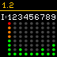
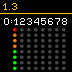
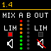
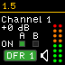
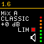

## Shure SCM820

This module will connect to the Shure SCM820 Digital IntelliMix Automatic Mixer to provide control and feedback status.

### Available actions

| Title                        | Support      |
| ---------------------------- | ------------ |
| Set channel name             | All          |
| Set channel mute             | All          |
| Set channel gain             | All          |
| Increase channel gain        | All          |
| Decrease channel gain        | All          |
| Set channel always on in mix | Channels 1-8 |
| Set IntelliMix Mode          | Mix A & B    |
| Set DFR assigned channel     | DFR 1 & 2    |
| Set DFR bypass               | DFR 1 & 2    |
| Clear DFR filters            | DFR 1 & 2    |
| Set DFR freeze               | DFR 1 & 2    |
| Set auto link mode           | Mixer        |
| Flash lights on the mixer    | Mixer        |

### Available feedbacks

| Title                    | Type   | Support              | Preview                                                     |
| ------------------------ | ------ | -------------------- | ----------------------------------------------------------- |
| Input Levels Display     | Icon   | Channels 1-8, Aux In |      |
| Output Levels Display    | Icon   | Channels 1-8         |    |
| Mixer Levels Display     | Icon   | Mix A & B            |      |
| Channel Status Display   | Icon   | Channels 1-8, Aux In |  |
| Mixer Status Display     | Icon   | Mix A & B            |      |
| Channel Mute             | BG, FG | All                  |                                                             |
| Channel Gain             | BG, FG | All                  |                                                             |
| Channel Always on in Mix | BG, FG | Channels 1-8         |                                                             |
| IntelliMix Mode          | BG, FG | Mix A & B            |                                                             |
| DFR Assigned Channel     | BG, FG | DFR 1 & 2            |                                                             |
| DFR Bypassed             | BG, FG | DFR 1 & 2            |                                                             |
| DFR Frozen               | BG, FG | DFR 1 & 2            |                                                             |
| Auto Link Mode Enabled   | BG, FG | Mixer                |                                                             |
